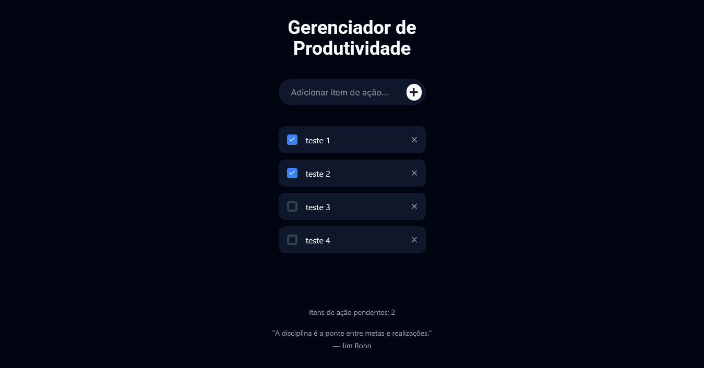

# Todo Json-server

This is a simple task management website where users can create tasks, mark them as complete or incomplete, and delete them. The application also displays the total number of incomplete tasks, helping users keep track of their progress.

---

## 📷 Screenshots

### Desktop



---

## ✨ Features

- Create new tasks
- Mark tasks as complete or incomplete
- Delete tasks
- Display the number of incomplete tasks

---

## 🚀 Technologies

- React

- TypeScript

- TailwindCSS

- Taiwind Variants

- Tailwind Merge

- ESLint

- Prettier

- Vite

---

## 📦 How to use

1. Clone the repository:

```bash
git clone https://github.com/michaelprocha/todo-json-server
```

2. Dowloand [NodeJS](https://nodejs.org/en/download).

3. Install dependencies:

```bash
npm install
```

4. Run locally

```bash
npm run dev
```

---

## 👨‍💻 Author

Made by [Michael Rocha](https://github.com/michaelprocha)

---

## 📄 License

This project is licensed under the MIT License. See the LICENSE file for more details.
